# Survival Shooter: Extended Edition
## Tugas Besar 2 IF3210 Pengembangan Aplikasi pada Platform Khusus
---
## Description
Survival Shooter 3D: Extended Edition merupakan sebuah permainan 3D camera shooter yang tersedia dalam mode Third-Person dan First-Person. Pada permainan ini, pemain diharuskan untuk melawan musuh-musuh yang berada di dalam map. Terdapat tiga buah mode, yaitu Zen Mode, Wave Mode, dan Rush Mode. Zen Mode merupakan endless mode dimana pemain harus bertahan hidup dari serangan musuh dalam waktu yang selama mungkin. Wave Mode merupakan mode permainan yang terdiri dari beberapa wave spawn musuh dengan tingkat kesulitan yang meningkat dari satu wave ke wave lainnya. Rush Mode merupakan mode permainan dimana pemain diharuskan untuk membunuh musuh sebanyak-banyaknya dalam waktu yang terbatas.
## Requirements
- [Unity Editor](https://unity.com/download)
- [C#](https://docs.microsoft.com/en-us/dotnet/csharp/)
## How it Works

### Attribute Player
Atribut yang dimiliki oleh seorang pemain adalah:
- _Health_ - Jumlah darah yang dimiliki oleh pemain. Jika serangan musuh berhasil mengenai pemain, maka darah pemain akan berkurang. Jika darah pemain telah habis, maka pemain akan mati.
- _Damage_ - Jumlah damage yang dimiliki oleh pemain. Damage merupakan kerusakan yang dapat ditimbulkan pemain ketika menyerang musuh.
- _Speed_ - Kecepatan pemain. Speed digunakan untuk mengatur kecepatan gerak pemain dalam suatu map.

### Orbs
Orbs yang ada dalam permainan ini adalah:
- _Health Orb_ - Orb ini membantu pemain untuk recover darahnya.
- _Damage Orb_ - Orb ini akan menambah damage yang dapat ditimbulkan oleh pemain.
- _Speed Orb_ - Orb ini akan menambahkan kecepatan gerak pemain.

### Additional Mobs
Terdapat beberapa jenis musuh yang ada di dalam permainan ini, yaitu:
- _Skeleton/Robot_ - Mobs ini tidak bisa bergerak, namun bisa menyerang dari jauh. Hal ini diimplementasikan dengan menggunakan Ray Length, apabila player berada di dalam radius tersebut maka skeleton/robot dapat menyerang pemain.
- _Bomber_ - Mobs ini dapat bergerak mendekati pemain dengan kecepatan yang lebih tinggi dibandingkan mobs lainnya. Jika mobs sudah berada di radius tertentu di dekat player, ia akan meledakkan dirinya. Implementasi ini dilakukan dengan mengubah kecepatan mobs pada NavMeshAgent serta menambahkan script untuk meledakkan sendiri.
- _Boss_ - Mobs ini memiliki ukuran yang lebih besar dibandingkan mobs lainnya serta memiliki darah yang lebih banyak dibandingkan mobs lainnya. Implementasi ini dilakukan dengan menambahkan jumlah startingHealth pada script EnemyHealth
### Game Mode
Pada permainan ini, terdapat tiga buah mode permainan, yaitu Zen Mode, Wave Mode, dan Rush Mode. Zen Mode diimplementasikan menggunakan cara yang sama dengan base game, namun terdapat script tambahan berupa TimeManager untuk menghitung durasi permainan. Wave Mode diimplementasikand engan memodifikasi base game dan menambahkan script WaveManager. WaveManager berfungsi untuk mengatur jalannya wave permainan seperti mengatur spawning state musuh, kapan wave selesai, dan upgrade weapon pemain. Rush Mode diimplementasikan dengan menggunakan cara yang serupa dengan Zen Mode, namun terdapat perbedaan yaitu pada mode ini, timer permainan berkurang dari pre-defined time hingga 0.
### Weapon Upgrade
Terdapat dua jenis upgrade weapon yang dapat terjadi, yaitu:
- _Diagonal Upgrade_ - Digunakan untuk mengubah jumlah bullet yang dapat ditembakkan pemain dalam satu waktu. Upgrade ini diimplementasikan dengan menambahkan jumlah GunBarrelEnd, kemudian mengatur aktivasi dari GunBarrelEnd sesuai dengan level.
- _Weapon Speed_ - Digunakan untuk mengubah kecepatan tembakan player. Upgrade ini diimplementasikan dengan mengurangi jarak antar bullet yang dimiliki player.
### Local Scoreboard
Local Scoreboard diimplementasikan dengan menggunakan ScoreboardManager yang mengatur scoreboard mana yang akan muncul. Terdapat WaveScoreBoard dan ZenScoreBoard yang akan menampilkan 10 hasil permainan tertinggi serta menambahkan hasil dari permainan baru ke dalam scoreboard. Scoreboard diimplementasikan menggunakan PlayerPrefs dengan menyimpan sebuah JSON dalam bentuk string yang berisi setiap entry dalam scoreboard.
### Main Menu
Implementasi Main menu diimplementasikan dengan tujuan untuk interaksi pengguna. Pada menu ini terdapat textfield untuk menyimpan nama pemain, beberapa button yang dapat digunakan untuk memilih mode permainan. Data nama pemain disimpan dalam sebuah PlayerPrefs sehingga nama pemain tidak hilang ketika terjadi perpindahan scene.
### Game Over
Game Over merupakan sebuah state yang muncul ketika darah pemain telah habis. Pada splash screen ini, ditampilkan pesan game over serta dua buah button, yaitu "Main Menu" untuk kembali ke menu awal serta "New Game" untuk memulai permainan dari awal kembali. Seluruh bagian dari interface ini diimplementasikan sebagai child dari HUDCanvas.
### FPS Mode (Bonus)
Terdapat alternatif sudut pandang kamera yang dapat digunakan pada game ini, yaitu kamera first person dan kamera third person. Secara default, kamera utama yang digunakan adalah kamera third person, namun pemain dapat mengubah sudut pandang kamera menjadi first person, dengan menekan tombol 'V'. Kamera first person dimasukkan sebagai child object dari player. Ketika sedang tidak digunakan, kamera ini di-disable. Ketika menggunakan first person mode, script player movement juga harus disesuaikan kembali dengan memperhatikan arah gerak relatif terhadap posisi dan rotasi player pada saat itu. 

## Library
- __PlayerPrefs__ - Digunakan untuk menyimpan data pemain untuk keperluan sehingga data tetap tersedia ketika permainan dimulai ulang.

## Screenshot

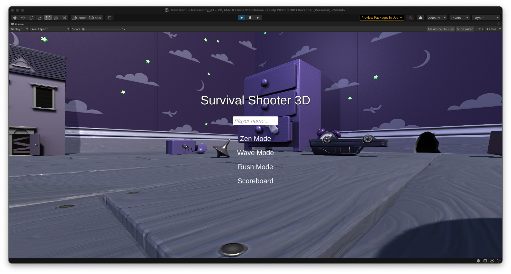

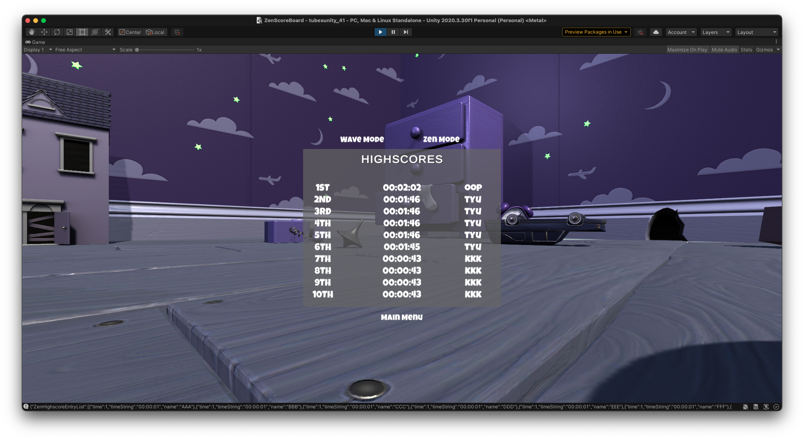
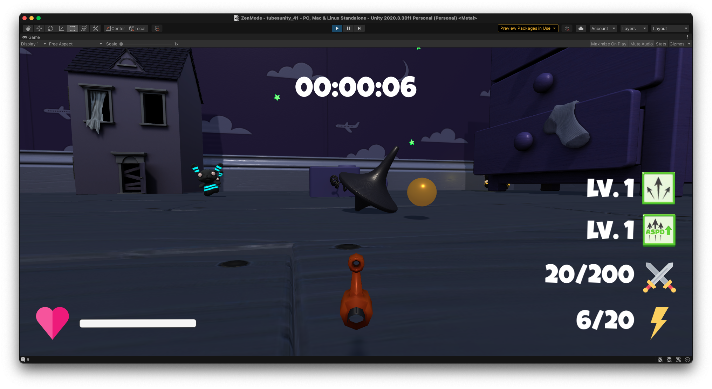
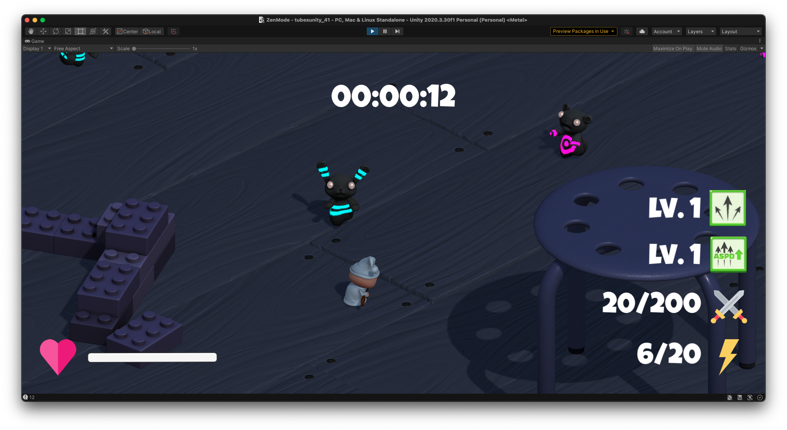
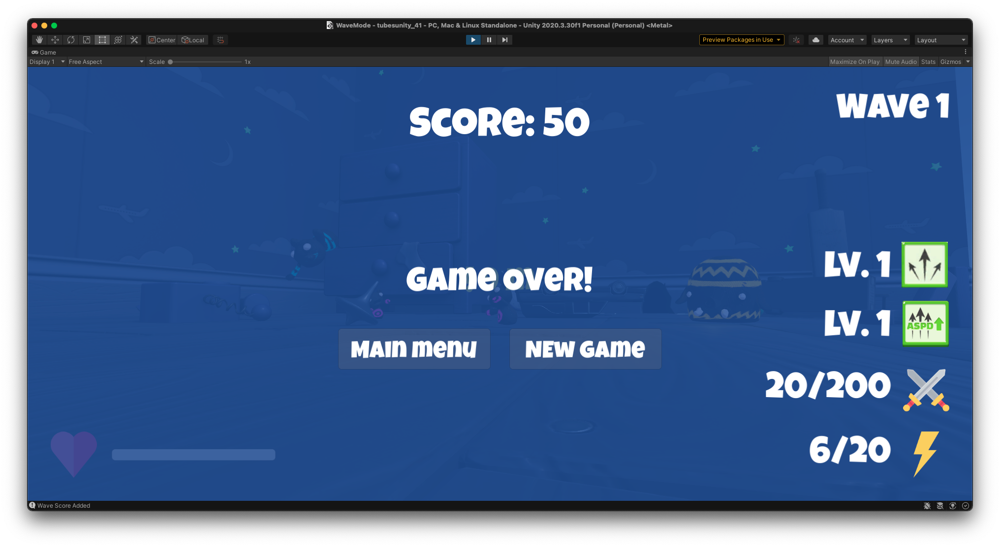
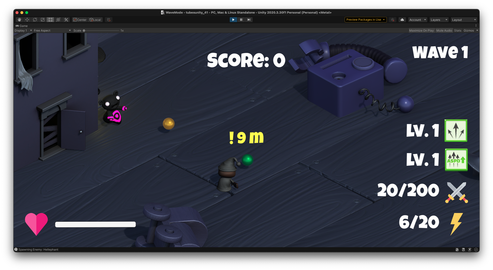
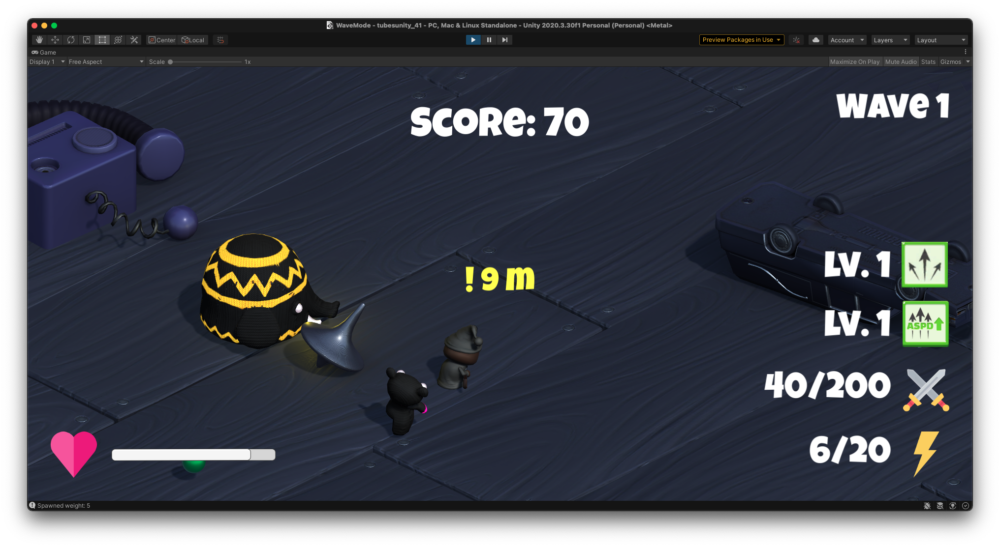
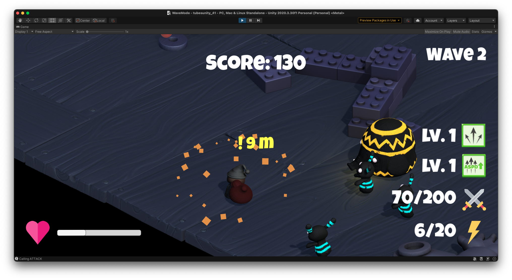
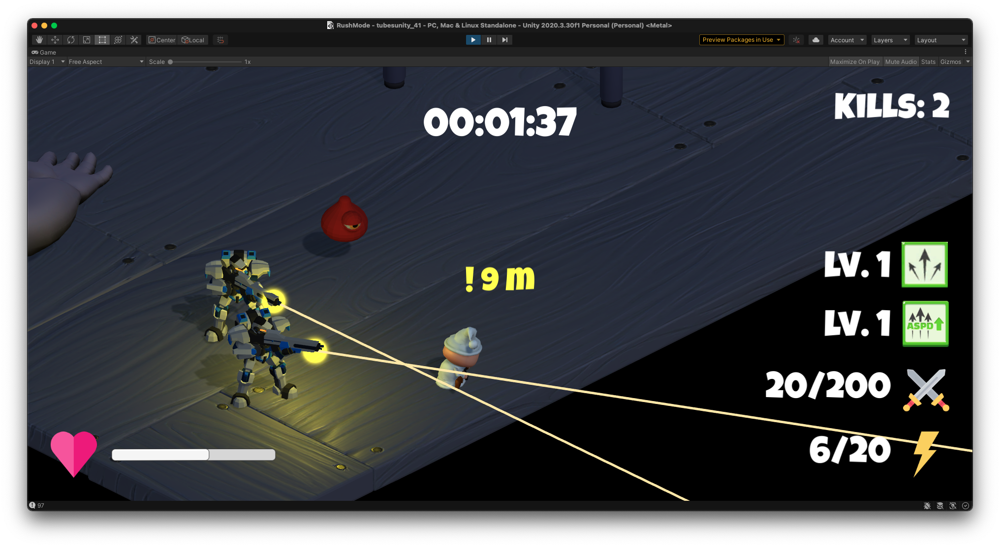
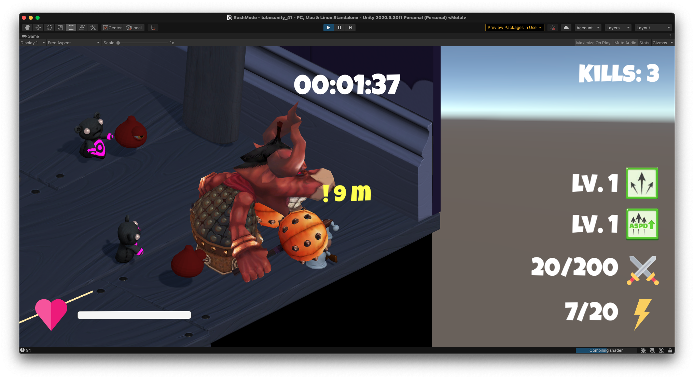
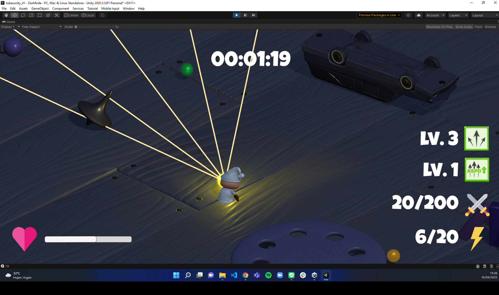
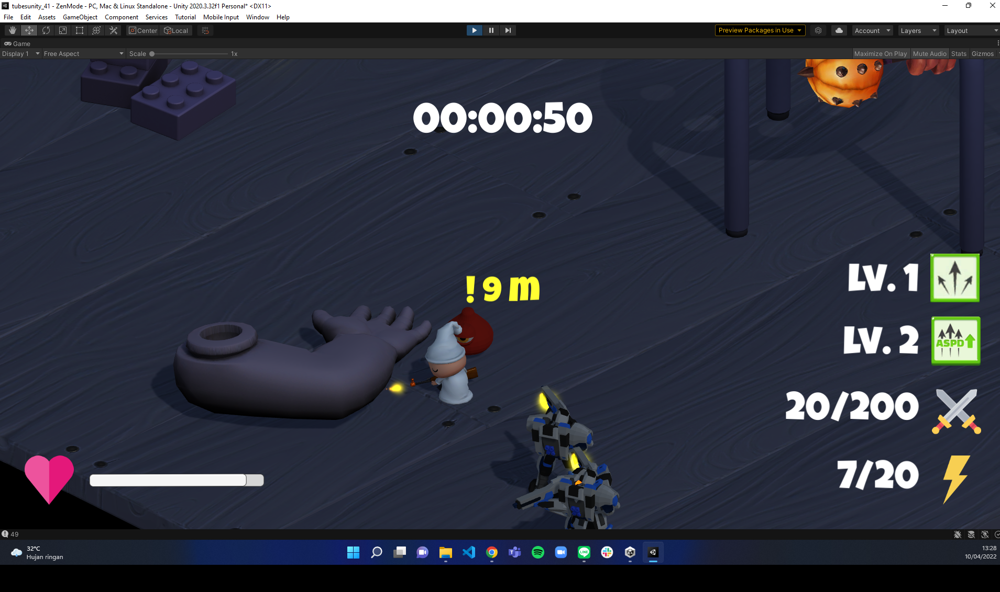

## Pembagian Tugas
| Fitur  | 13519080 | 13519106 | 13519158 |
| --- | --- | --- | --- |
| Attribute Player      | :white_check_mark:    | :white_check_mark:    |                    |
| Orbs                  |                       | :white_check_mark:    | :white_check_mark: |
| Additional Mobs       |                       | :white_check_mark:    | :white_check_mark: |
| Zen Mode              | :white_check_mark:    | :white_check_mark:    |                    |
| Wave Mode             |                       | :white_check_mark:    | :white_check_mark: |
| Rush Mode (Bonus)     | :white_check_mark:    | :white_check_mark:    |                    |
| Weapon Upgrade        |                       |                       | :white_check_mark: |
| Local Scoreboard      | :white_check_mark:    |                       |                    |
| Main Menu             | :white_check_mark:    |                       | :white_check_mark: |
| Game Over             | :white_check_mark:    |                       | :white_check_mark: |
| FPS Mode              |                       | :white_check_mark:    |                    |

## Credits

- Unity Learn
- Agate Academy

## Author
- Daru Bagus Dananjaya - 13519080
- Shifa Salsabiila - 13519106
- Muhammad Fikri Naufal - 13519158

---
_Program Studi Teknik Informatika_  
_Sekolah Teknik Elektro dan Informatika_  
_Institut Teknologi Bandung_  

_Semester II Tahun 2021/2022_
